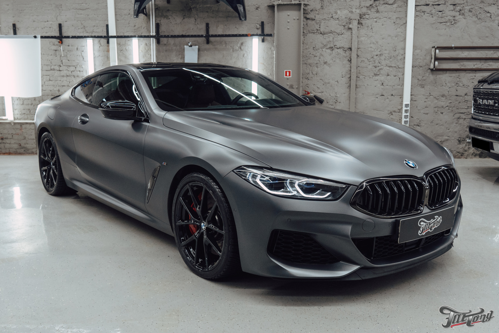

# Оптимизация изображений для SEO

## Рекомендации по оптимизации изображений

### 1. Форматы изображений
- **WebP** - современный формат с лучшим сжатием
- **JPEG** - для фотографий
- **PNG** - для изображений с прозрачностью
- **SVG** - для векторной графики

### 2. Размеры изображений
- **Header изображение**: 1200x630px (для социальных сетей)
- **Логотипы**: 200x200px
- **Иконки**: 64x64px
- **Фотографии товаров**: 800x600px

### 3. Оптимизация файлов
```bash
# Установка инструментов оптимизации
npm install -g imagemin-cli
npm install -g imagemin-webp

# Оптимизация JPEG
imagemin img/*.jpg --out-dir=img/optimized

# Конвертация в WebP
imagemin img/*.{jpg,png} --plugin=webp --out-dir=img/webp
```

### 4. Атрибуты для SEO
```html
<!-- Правильная разметка изображений -->

```

### 5. Responsive изображения
```html
<picture>
  <source srcset="img/header.webp" type="image/webp">
  <source srcset="img/header.jpg" type="image/jpeg">
  
</picture>
```

### 6. Структурированные данные для изображений
```json
{
  "@context": "https://schema.org",
  "@type": "ImageObject",
  "contentUrl": "https://avtobelgium.by/img/avto_header.jpg",
  "name": "Авто из Бельгии",
  "description": "Профессиональный подбор и доставка автомобилей из Бельгии в Беларусь",
  "license": "https://avtobelgium.by/",
  "creator": {
    "@type": "Organization",
    "name": "AvtoBelgium"
  }
}
```

### 7. Файлы для создания
- favicon.ico (16x16, 32x32, 48x48)
- apple-touch-icon.png (180x180)
- favicon-32x32.png
- favicon-16x16.png
- manifest.json (для PWA)

### 8. Команды для оптимизации
```bash
# Создание favicon
convert logo.png -resize 16x16 favicon-16x16.png
convert logo.png -resize 32x32 favicon-32x32.png
convert logo.png -resize 180x180 apple-touch-icon.png

# Оптимизация всех изображений
find img/ -name "*.jpg" -exec jpegoptim --strip-all {} \;
find img/ -name "*.png" -exec optipng -o5 {} \;
```

### 9. Проверка оптимизации
- Google PageSpeed Insights
- GTmetrix
- WebPageTest
- Lighthouse

### 10. Рекомендуемые размеры файлов
- Header изображение: < 200KB
- Логотипы: < 50KB
- Иконки: < 10KB
- Фотографии: < 500KB 